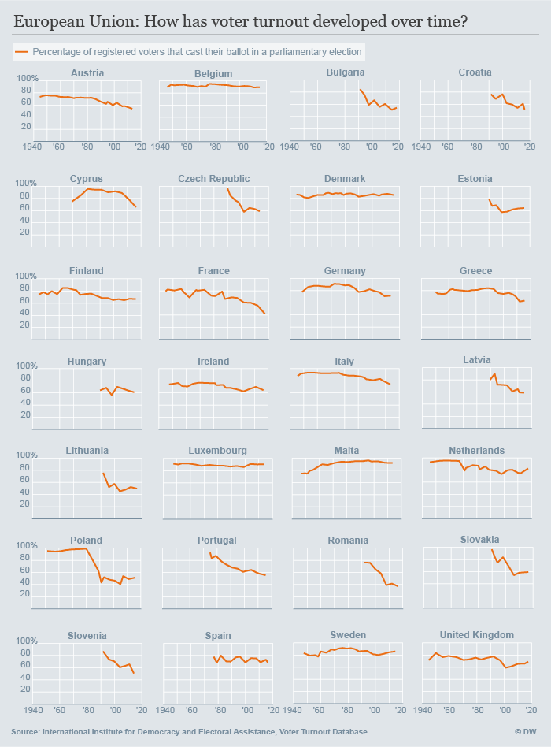

# How has voter turnout developed?

### Data Source

[Voter Turnout Database](http://www.idea.int/data-tools/data/voter-turnout) by International Institute for Democracy and Electoral Assistance.

Data was first exported on April 12th, 2017. The data for the elections in France and Great Britain were added later on.
Adding data of most recent elections in UK and France
UK [68.7%](http://www.ukpolitical.info/Turnout45.htm)
France [42.6%](http://www.politico.eu/article/4-takeaways-from-the-french-parliamentary-election/) (second round was counted in the past too)

### Definitions

Voter turnout is measured as the percentage of registered voters who cast their ballot in the respective national parliamentary election. Also voters whose vote is invalid will be counted.

### Methodology

Visualized with Python as small multiples, using [code by Jonathan Soma](http://jonathansoma.com/lede/data-studio/classes/small-multiples/long-explanation-of-using-plt-subplots-to-create-small-multiples/)

### Output
Belgium is the only country with compulsory voting in Europe, however even without this obligation countries like Denmark, Luxembourg and Malta have pretty high turnouts.

* Malta has the highest turnout it all of Europe
Experts say that's due to Malta's special voting systems, where voters rank candidates according to their own preference, irrespective of their party affiliation. Each candidate needs to reach a certain quota to get a seat in parliament.

* Romania has the lowest

* France has the worst in all of Western Europe, however figures are better for the presidential election that's considered more important in France

